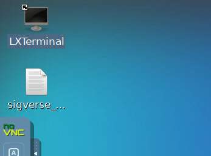
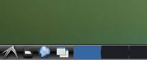

# docker-ros

SIGVerse用のVNC接続可能なUbuntuデスクトップDockerコンテナを作成するためのリポジトリです。

SIGVerse管理者用であり、ユーザが実行する必要はありません。  
次のイメージをベースにしています。  
https://github.com/Tiryoh/docker-ros-desktop-vnc

Windowsでイメージのビルドを行う例を以降に示します。

## DockerfileからDockerイメージを作成する

Windows PowerShell で実行します。

1. Windows PowerShell を起動します。
1. docker loginコマンドで稲邑研のDocker Hubアカウントにログインします。ID/Passwordは別途確認してください。  
`> docker login`
1. 本リポジトリをcloneします
1. 本リポジトリのDockerfileが存在するディレクトリに移動します。
1. Dockerイメージをビルドします。  
`> docker build . -t inamuralab/sigverse-ros-noetic`
1. DockerイメージをDocker Hubに送信します。  
`>  docker push inamuralab/sigverse-ros-noetic`

## Dockerイメージからコンテナを起動する

Windows PowerShell で実行します。

1. Dockerイメージをダウンロードし、Dockerコンテナを作成・起動します。  
`> docker run -p 6080:80 -p 9090:9090 -p 50001:50001 inamuralab/sigverse-ros-noetic`
1. 起動完了するまで待ちます。以下のような状態であれば起動完了しています。

1. ブラウザを起動し、以下にアクセスします。  
http://127.0.0.1:6080/
1. 以下のような画面が表示されます。  
  

