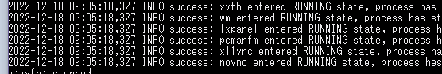
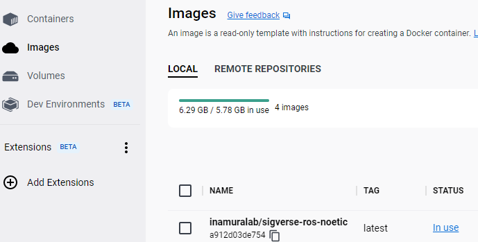
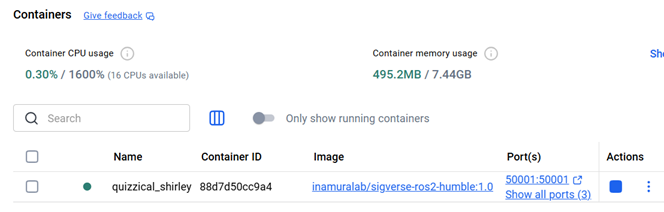
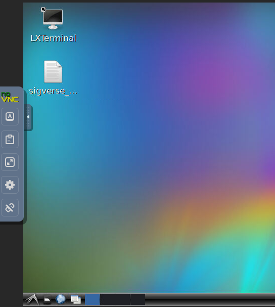

# docker-ros

SIGVerse用のVNC接続可能なUbuntuデスクトップDockerコンテナを使用するためのリポジトリです。  
デスクトップはLXDEという軽量なものです。

次のイメージをベースにしています。  
https://github.com/Tiryoh/docker-ros-desktop-vnc

Windowsでイメージのビルドを行う例を以降に示します。

## DockerfileからDockerイメージを作成する

**この作業はSIGVerse管理者用が行う作業であり、ユーザが実行する必要はありません。**

1. Docker Desktopをインストールします。  
https://www.docker.com/products/docker-desktop/
1. Windows PowerShell を起動します。（以降のコマンドはWindows PowerShell で実行します）
1. バージョン確認コマンドを実行してDockerコマンドが動くことを確認してください。  
`> docker --version`
1. docker loginコマンドで稲邑研のDocker Hubアカウントにログインします。（ID/Passwordは別途確認してください）  
`> docker login`
1. 本リポジトリをダウンロードし、ローカルに解凍します。
1. 本リポジトリのDockerfileが存在するディレクトリに移動します。
1. Dockerイメージをビルドします。  
`> docker build . -t inamuralab/sigverse-ros-noetic`
1. DockerイメージをDocker Hubに送信します。  
`>  docker push inamuralab/sigverse-ros-noetic`

## DockerイメージからDockerコンテナを起動する（初回起動）

1. Docker Desktopをインストールします（未インストールの場合）  
https://www.docker.com/products/docker-desktop/
1. Docker Desktopを起動して正常に起動することを確認してください。
1. Windows PowerShell を起動します。（以降のコマンドはWindows PowerShell で実行します）
1. Dockerイメージをダウンロードし、Dockerコンテナを作成・起動します。  
解像度オプション（-e RESOLUTION=1920x1080）を付ければ解像度を変更可能です。  
`> docker run -p 6080:80 -p 5900:5900 -p 9090:9090 -p 50001:50001 inamuralab/sigverse-ros-noetic`
1. 起動完了するまで待ちます。以下のような状態であれば起動完了しています。
  
Docker DesktopのImagesには以下のようなImageが追加されています。  
  
Docker DesktopのContainersには以下のようなコンテナが起動します。コンテナ名は適当に決定されます。  
  
1. ブラウザを起動し、以下にアクセスします。  
http://127.0.0.1:6080/  
またTigerVNCなどのVNCクライアントを使用してアクセスすることも可能です。その場合ポート番号は5900です。
1. 以下のようなLXDEのUbuntuデスクトップ画面が表示されます。  
画面左側にはVNCツールがありVNCに関わる機能が使用可能です。  
  

## Dockerコンテナを使用する

+ デスクトップに sigverse_commands.txt が置いてあり、参考となるROSコマンドが書かれています。
+ 画面左側のVNCツールで Clipboard が使用可能です。
+ 画面左側のVNCツールの設定で、Scaling Modeを"Local Scaling"にするとブラウザサイズに合わせて画面が伸縮します。

## Dockerコンテナを停止する
1. 画面左側のVNCツールで Disconnect をクリックして切断します。
1. Docker Desktopのコンテナ一覧から当該コンテナを停止します。

## Dockerコンテナの起動（２回目以降）

既にコンテナが存在しているのでDocker Desktopのコンテナ一覧から起動できます。  
Windows PowerShell は使用しません。
