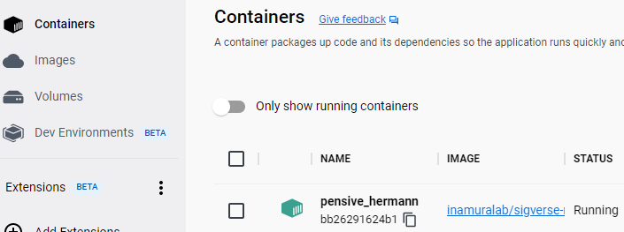

# docker-ros

SIGVerse用のVNC接続可能なUbuntuデスクトップDockerコンテナを使用するためのリポジトリです。  
次のイメージを使用します。  
https://github.com/Tiryoh/docker-ros2-desktop-vnc

## Dockerイメージを作成して公開する

**この作業はSIGVerse管理者が行う作業であり、ユーザが実行する必要はありません。**

**Dockerfileは作成していません。** Dockerビルドでubuntuユーザを使用して環境構築することが難しかったためです。

1. Docker Desktopをインストールします。  
https://www.docker.com/products/docker-desktop/
1. Docker Desktopを起動して正常に起動することを確認してください。
1. Windows PowerShell を起動します。
1. バージョン確認コマンドを実行してDockerコマンドが動くことを確認してください。  
    ```sh
    docker --version
    ```
1. docker loginコマンドで稲邑研のDocker Hubアカウントにログインします。（ID=inamuralab/Passは別途確認してください）  
    ```sh
    docker login
    ```
1. ベースとなるDockerイメージをダウンロードし、Dockerコンテナを作成・起動します。  
    ```sh
    docker run -p 6080:80 --security-opt seccomp=unconfined --shm-size=512m ghcr.io/tiryoh/ros2-desktop-vnc:humble
    ```
1. 起動完了するまで待ちます。以下のような状態であれば起動完了しています。
  
1. Docker DesktopのContainersにコンテナが表示されていることを確認します。コンテナ名はランダムに決定されます。  
  
1. Webブラウザを起動し、以下にアクセスします。  
http://127.0.0.1:6080/  
1. 接続ボタンをクリックします。  
Ubuntuデスクトップ画面が表示されます。画面左側にはVNCツールがあります。  
1. デスクトップのTerminatorを起動します。
1. SIGVerseをインストールします。 
    ```sh
    wget https://raw.githubusercontent.com/SIGVerse/docker-ros/main/humble/sigverse_setup.sh
    chmod +x sigverse_setup.sh
    ./sigverse_setup.sh
    ```
1. 不要ファイルを削除します。
    ```sh
    rm sigverse_setup.sh
    sudo rm -rf /var/lib/apt/lists/*
    ```
1. sigverse_commands.txtをダウンロードします。
    ```sh
    wget https://raw.githubusercontent.com/SIGVerse/docker-ros/refs/heads/main/humble/sigverse_commands.txt
    ```
1. sigverse_commands.txtをデスクトップに配備してください。
1. HSR用のROS2ノードが起動することを確認します。
    ```sh
    source ~/.bashrc
    ros2 launch sigverse_hsr_teleop_key teleop_key_launch.xml
    ```
1. 画面左側のVNCツールでVNC接続を切断します。
1. Docker Desktopのコンテナ一覧画面でベースイメージのコンテナを停止します。
1. DockerイメージをDocker Hubに送信し公開します。  
Windows PowerShellで以下コマンドを実行してください。  
但し、Container IDは Docker Desktopで確認しコマンドを修正してください。  
またバージョン番号も適宜変更してください。   
    ```sh 
    docker commit <Container ID> sigverse-ros2-humble:1.0
    docker tag sigverse-ros2-humble:1.0 inamuralab/sigverse-ros2-humble:1.0
    docker login
    docker push inamuralab/sigverse-ros2-humble:1.0
    ```

## Dockerコンテナを起動する（初回起動）

1. Docker Desktopをインストールします（未インストールの場合）  
https://www.docker.com/products/docker-desktop/
1. Docker Desktopを起動して正常に起動することを確認してください。
1. Windows PowerShell を起動します。（以降のコマンドはWindows PowerShell で実行します）
1. Dockerイメージをダウンロードし、Dockerコンテナを作成・起動します。  
解像度オプション（-e RESOLUTION=1920x1080）を付ければ解像度を変更可能です。  
    ```sh
    docker run -p 6080:80 -p 9090:9090 -p 50001:50001 inamuralab/sigverse-ros2-humble:1.0
    ```
1. 起動完了するまで待ちます。以下のような状態であれば起動完了しています。
  
1. Docker DesktopのImagesにImageが追加されていることを確認します。  
  
1. Docker DesktopのContainersにコンテナが表示されていることを確認します。コンテナ名はランダムに決定されます。  
  

## Dockerコンテナを起動する（２回目以降）

既にコンテナが存在しているのでDocker Desktopのコンテナ一覧から起動できます。  
Windows PowerShell は使用しません。

## Dockerコンテナを使用する

1. Webブラウザを起動し、以下にアクセスします。  
http://127.0.0.1:6080/  
1. 接続ボタンをクリックします。  
Ubuntuデスクトップ画面が表示されます。  
画面左側にはVNCツールがあります。  
デスクトップには、コマンド例が書かれたsigverse_commands.txtが配置されています。  
 
1. Unityで設定するROS側のIPアドレスは127.0.0.1です。
 

## Dockerコンテナを停止する
1. 画面左側のVNCツールでVNC接続を切断します。
1. Docker Desktopのコンテナ一覧から当該コンテナを停止します。

## 補足

### Dockerイメージのファイル保存

Dockerイメージをファイル保存するには、Windowsの場合、PowerShellでコマンドを実行します。

ファイル保存  
```sh
docker save inamuralab/sigverse-ros-humble:1.0 -o docker-image-sigverse-humble.tar
```
ファイル読込  
```sh
docker load -i docker-image-sigverse-humble.tar
```
